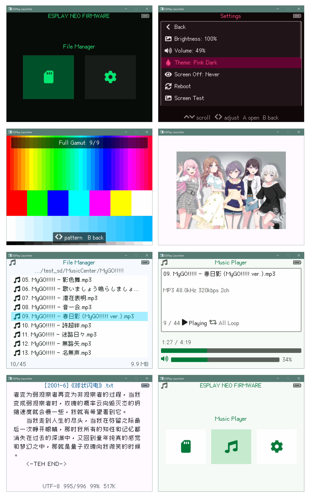

# ESPlay Neo Firmware

中文 · [English](./README-en.MD)



面向 **ESPlay Micro** 的固件：SD 卡文件管理、音频/文本预览与系统设置。Fork 自 [pebri86/esplay-retro-emulation](https://github.com/pebri86/esplay-retro-emulation)。

> **项目现状与开发约束请以 [CLAUDE.md](AGENTS.md) 为准**（功能范围、已移除模块、构建说明、PC Simulator 入口等）。本 README 仅作快速上手；上游 README 中 AppFS、WiFi 传文件、多模拟器 `.app` 等描述 **已过时**。

### 功能

- **文件管理** — 浏览 SD 卡、虚拟滚动、删除
- **音乐播放器** — WAV/MP3，支持后台播放
- **文本阅读器** — TXT 等支持格式，UTF-8 / GB2312
- **图片查看器** — 目前仅支持 BMP
- **设置** — 亮度、音量、主题、熄屏、重启、LCD 测试
- **中日韩字体**（Vonwaon 12px）
- **PC 模拟器**（可选）— 桌面端 UI 开发，见 [launcher/sim/README.md](launcher/sim/README.md)

**不包含**：AppFS 多应用、WiFi / HTTP 传 ROM、独立 Music 页（见 [CLAUDE.md](AGENTS.md)）。

### 构建

**环境**：ESP-IDF **v5.5.x**（推荐 v5.5.4），目标板 **ESPlay Micro**。

```shell
# 克隆（含子模块）
git clone --recurse-submodules git@github.com:canwdev/esplay-neo-firmware.git
cd esplay-neo-firmware

# ESP-IDF: install + export（见官方文档）
# https://github.com/espressif/esp-idf/releases/tag/v5.5.4

# 编译并烧录
cd launcher
idf.py build
idf.py flash monitor
```

日常 UI 迭代可只烧 app 分区：`idf.py app-flash monitor`（详见 [CLAUDE.md](AGENTS.md)）。

### 文档

| 文件                                             | 说明                                                              |
| ------------------------------------------------ | ----------------------------------------------------------------- |
| [CLAUDE.md](AGENTS.md)                           | **主文档** — 项目现状、功能、分区、构建、编码约定、Simulator 指引 |
| [launcher/sim/README.md](launcher/sim/README.md) | PC Simulator 构建、按键、testdata                                 |

[↑ 回到顶部](#esplay-neo-firmware)
