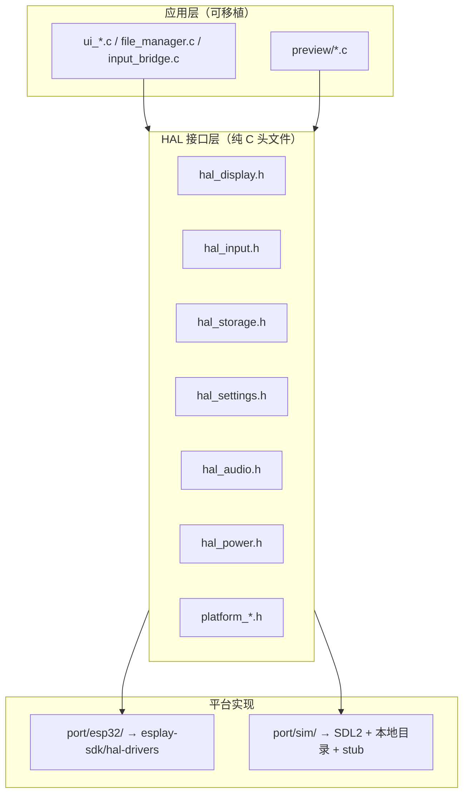

# LVGL PC Simulator — 重构与模拟计划

本文档描述 **Launcher 在 PC 上运行 LVGL Simulator** 的目标架构、分阶段迁移步骤，以及 **ESP32 内存不足** 在 Simulator 中的模拟方式。

- **现状约束**：见 [`AGENTS.md`](AGENTS.md)（当前无 host 目标，UI 需真机验证）。
- **本文档仅为计划**：实施前请按 Phase 逐步落地；未明确要求时不要一次性大改。

---

## 1. 目标

| 目标 | 说明 |
|------|------|
| PC 验证 GUI | Home / Settings / 文件列表 / Screen Test / 主题，320×240 SDL 窗口 |
| PC 验证文件列表 | 本地 `testdata/sd/` 映射为存储根路径，POSIX `dirent` |
| 缩短迭代 | UI 改动以 Simulator 为主，真机做最终验收 |
| 保持 ESP 构建 | 每个 Phase 结束后 `idf.py build` 仍可通过 |
| 可选内存压测 | 可控堆池 / 假 `free_heap`，覆盖文本截断、`malloc` 失败路径 |

**不替代真机**：ILI9341 观感、I2S 音质、FreeRTOS 任务栈、GPIO/I2C 手柄、`.dram0.bss` 链接限制、heap 碎片化。

**与 QEMU 的关系**：QEMU 适合启动/串口/GDB；本 Simulator 面向 **LVGL UI 与文件浏览**。二者互补，不互相替代。QEMU 限制见 [`AGENTS.md`](AGENTS.md#qemu仅启动与串口)。

---

## 2. 核心架构：三层 + 双入口



### 双入口

| 入口 | 文件（规划） | 职责 |
|------|--------------|------|
| ESP32 | `launcher/main/launcher_main.c` | `app_main`、ILI9341 flush、`esp_timer` tick、FreeRTOS 主循环 |
| PC Sim | `launcher/sim/main.c` | `main()`、SDL flush、SDL 事件 → gamepad、桌面主循环 |

应用逻辑通过 `app_init()` / `app_tick()`（规划）与平台入口解耦。

---

## 3. 建议目录结构（增量添加）

```
launcher/
  main/                    # 现有 ESP-IDF 组件（逐步瘦身）
    app/                   # Phase 2+：迁出的可移植 UI
      ui_*.c
      file_manager.c
      input_bridge.c
      preview/
  hal/                     # 新建：接口头文件
    hal_display.h
    hal_input.h
    hal_storage.h
    hal_settings.h
    hal_audio.h
    hal_power.h
    hal_system.h
    platform_log.h
    platform_time.h
    platform_mem.h
  port/
    esp32/                 # 薄适配 → hal-drivers
      hal_display_esp.c
      hal_input_esp.c
      ...
    sim/                   # SDL + stub
      hal_display_sdl.c
      hal_input_sdl.c
      hal_storage_posix.c
      hal_settings_file.c
      hal_audio_stub.c
      hal_power_stub.c
      platform_mem.c
  sim/
    CMakeLists.txt
    lv_conf.h
    testdata/sd/           # 模拟 SD 卡内容
```

现有 `esplay-sdk/hal-drivers/` **保留**，作为 `port/esp32` 后端，不重写 ILI9341 / gamepad 驱动。

编译宏建议：

- `TARGET_ESP32` — ESP-IDF 构建
- `TARGET_SIM` — PC Simulator 构建

---

## 4. 模块迁移对照

### 4.1 较易迁入 `app/`（改 include 即可）

| 文件 | 备注 |
|------|------|
| `ui_theme.c` / `ui_font.c` | 仅 LVGL |
| `ui_screen_test.c` | 纯 LVGL 色条，Sim 价值高 |
| `ui_home.c` | 去掉对 `lcd.h` 的直接依赖 |
| `ui_chrome.c` | `battery_level_read` → `hal_power_read_battery()` |
| `input_bridge.c` | `gamepad_read` → `hal_input_read()` |

### 4.2 需 HAL 化后再迁

| 文件 | 当前耦合 | 应对 |
|------|----------|------|
| `file_manager.c` | 硬编码 `/sd`、`esp_heap_caps`、`audio_stop_playback` | `hal_storage_root()`、`platform_*`、`hal_audio_stop()` |
| `ui_settings.c` | `lcd_*`、`audio_*`、`sdcard_*`、`power_*`、`esp_restart` | 全部走 HAL |
| `ui_backlight.c` | `lcd_set_brightness` | `hal_display_set_brightness()` |
| `preview_text.c` | `esp_get_free_heap_size`、`malloc` | `platform_free_heap()` / `platform_malloc()` |
| `preview_audio.c` | `audio_*`、`vTaskDelay`、`opendir` | Sim Phase 1 **不链接**；或 stub 仅更新 UI |

### 4.3 留在 ESP 专用

| 文件 | 原因 |
|------|------|
| `launcher_main.c` | `app_main`、`esp_lcd`、`esp_timer`、NVS |
| `esplay-sdk/hal-drivers/*` | 真机驱动实现 |

### 4.4 依赖断开优先级

```
launcher_main.c   → esp_lcd, esp_timer, FreeRTOS     [留 ESP]
file_manager.c    → /sd 硬编码, esp_log/heap          [Phase 2]
ui_settings.c     → 多 HAL + esp_restart               [Phase 3]
preview_audio.c   → audio + vTaskDelay                 [Phase 4 或 stub]
input_bridge.c    → gamepad.h（含 Kconfig/GPIO）       [Phase 1 → hal_input.h]
lcd.h             → esp_lcd_panel_io.h                 [不可进 app/]
```

`gamepad.h` 中的 `CONFIG_ESPLAY20_HW`、GPIO 宏应留在 `port/esp32/`；可移植层只使用 `hal_input.h` 中的 `input_gamepad_state` / `GAMEPAD_INPUT_*`。

---

## 5. HAL 接口设计（草案）

接口层 **不出现** `esp_lcd_panel_handle_t`、`esp_err_t`（可用 `int` / `bool`）。

### 5.1 `hal_display.h`

```c
#define HAL_DISPLAY_WIDTH  320
#define HAL_DISPLAY_HEIGHT 240

void hal_display_init(void);
void hal_display_flush(int x1, int y1, int x2, int y2, uint8_t *rgb565);
void hal_display_set_brightness(uint8_t pct);  /* 0–100 */
```

- **ESP**：`lvgl_flush_cb` 内调用；内部仍 `lcd_draw` + `lv_draw_sw_rgb565_swap`。
- **Sim**：SDL 纹理上传；窗口可 2× 缩放便于调试。

### 5.2 `hal_input.h`

```c
void hal_input_init(void);
void hal_input_read(input_gamepad_state *out);
void hal_input_poll(void);  /* Sim：SDL 事件；ESP：可选空操作 */
```

`input_gamepad_state` 与 `GAMEPAD_INPUT_*` 从此头文件导出（自 `gamepad.h` 迁出）。

**Sim 键盘映射（建议）**：

| 键 | 手柄 |
|----|------|
| ↑ ↓ ← → | D-pad |
| Z / Enter | A |
| X / Backspace | B |
| M | Menu |
| S | Start |
| Esc | Select |

### 5.3 `hal_storage.h`

```c
const char *hal_storage_root(void);   /* ESP: "/sd"；Sim: 绝对路径 .../testdata/sd */
bool hal_storage_mount(void);
void hal_storage_get_free_kb(uint32_t *total_kb, uint32_t *free_kb);
```

`file_manager.c` 中所有 `"/sd"` 比较与路径拼接改为基于 `hal_storage_root()`。

### 5.4 `hal_settings.h`

与现有 `settings.h` 的 `Setting` 枚举对齐：

```c
int hal_settings_load(Setting id, int32_t *v);
int hal_settings_save(Setting id, int32_t v);
```

- **ESP**：NVS（`hal-drivers/settings.c`）
- **Sim**：`~/.esplay-launcher/settings.ini` 或 `./sim_settings.json`

### 5.5 `hal_audio.h`

与 `audio.h` 常用子集对齐：

```c
void hal_audio_init(void);
bool hal_audio_is_playing(void);
void hal_audio_play_file(const char *path);
void hal_audio_stop(void);
void hal_audio_set_volume(uint8_t pct);
/* ... */
```

- **Sim Phase 1**：空实现，`is_playing` 恒 `false`（主循环无需 25 fps 节流）。
- **Sim Phase 2（可选）**：SDL_mixer / miniaudio 播 WAV。

### 5.6 `hal_power.h`

```c
typedef struct {
  int millivolts;
  int percentage;
  int charging;  /* 0/1 */
} hal_battery_t;

void hal_power_init(void);
bool hal_power_read_battery(hal_battery_t *out);
```

- **Sim**：固定值，如 4200 mV / 85% / 未充电。

### 5.7 `platform_*.h`

```c
/* platform_log.h */
void platform_log(int level, const char *tag, const char *fmt, ...);

/* platform_time.h */
uint32_t platform_millis(void);
void platform_sleep_ms(uint32_t ms);

/* platform_mem.h — 见第 7 节 */
void *platform_malloc(size_t size);
void platform_free(void *ptr);
uint32_t platform_free_heap(void);
uint32_t platform_largest_free_block(void);

/* hal_system.h */
const char *hal_system_app_version(void);
void hal_system_reboot(void);
```

---

## 6. 分阶段迁移

每个 Phase 结束时应满足：**ESP `idf.py build` 通过**；若 Sim 已搭建，则 **Sim 可运行当前阶段功能**。

### Phase 0 — 准备（无行为变化）

1. 新建 `launcher/hal/*.h` 声明。
2. 新建 `launcher/port/esp32/`，实现为 **转调现有 hal-drivers**。
3. 定义 `TARGET_ESP32` / `TARGET_SIM`。
4. （可选）在 `launcher_main.c` 预留 `app_init()` / `app_tick()` 调用点。

**预估**：1–2 天。

### Phase 1 — 显示 + 输入 + 主页

1. 新建 `launcher/sim/` CMake + SDL2 + LVGL 9.4（与 `idf_component.yml` 同版本）。
2. 迁移：`ui_home`、`ui_theme`、`ui_chrome`、`ui_font`、`input_bridge`、`ui_screen_test`。
3. Sim 跑通：320×240 窗口、键盘切换 Files/Settings、Screen Test 色条。

**预估**：2–3 天。  
**收益**：主题与布局改动可在 PC 完成。

### Phase 2 — 文件管理器

1. 迁移 `file_manager.c`，路径走 `hal_storage_root()`。
2. 准备 `launcher/sim/testdata/sd/`（结构与 [`AGENTS.md`](AGENTS.md) 标准测试 SD 一致）：

   | 目录 | 用途 |
   |------|------|
   | `empty/` | 空目录 |
   | `many/` | 接近 512 文件 |
   | `names/` | 长文件名、CJK |
   | `mixed/` | 目录+文件混排 |
   | `media/` | wav、mp3、txt |
   | `deep/a/b/c/` | 多级路径 |

3. Sim **不链接** `preview_audio.c`；文本预览可选 Phase 2b。

**预估**：2–3 天。  
**收益**：列表、虚拟滚动、Delete 对话框、长文件名。

### Phase 3 — Settings + 背光

1. 迁移 `ui_settings.c`、`ui_backlight.c`。
2. Sim 上 Reboot → `exit(0)` 或重启进程。

**预估**：1–2 天。

### Phase 4 — 预览（可选）

| 模块 | Sim 策略 |
|------|----------|
| `preview_text.c` | 高价值；依赖 `platform_mem` |
| `preview_audio.c` | 低优先级；stub 或 SDL 音频 |

**预估**：2–5 天。

### Phase 5 — 收敛

- ESP：`launcher/main/CMakeLists.txt` = 入口 + `port/esp32` + `app/`。
- Sim：独立 `launcher/sim/CMakeLists.txt`。
- 文档与 `AGENTS.md` 开发效率章节同步更新。

---

## 7. ESP32 内存不足模拟

### 7.1 默认行为

PC Simulator 使用系统 `malloc`，可用内存为 GB 级，**不会自然触发** ESP32 OOM。必须通过 `platform_mem` **显式模拟**。

### 7.2 本项目中的内存敏感点

| 场景 | 行为 | 相关 API |
|------|------|----------|
| 文件列表 ≤512 项 | `malloc(want * sizeof(fm_entry_t))`，失败则日志 + `return` | `malloc`、`platform_free_heap`、`platform_largest_free_block` |
| 进预览前 | `free(s_entries)` 腾堆 | 设计互斥 |
| 音频歌单 | `malloc(512 * FM_NAME_LEN)` ≈ 64KB | `preview_audio.c` |
| 音频任务栈 | FreeRTOS **32768 words**（≈128KB） | 与堆分离，Sim 难模拟 |
| 文本预览 | 按 `free_heap` 决定读取大小；失败则减块重试 | `preview_text.c` |
| LVGL | partial buffer ~15KB×2 + 控件堆 | 静态 + `CONFIG_LV_USE_CLIB_MALLOC` |

真机峰值：`s_entries` 与 `s_playlist` **不同时** 常驻；文本预览会 **动态缩读**。见 [`AGENTS.md`](AGENTS.md#flash--ram-参考精简后-launcher)。

### 7.3 能模拟 / 不能模拟

| 能模拟（有价值） | 难 / 不能模拟 |
|------------------|---------------|
| `malloc` 失败路径 | `.dram0.bss` 链接期溢出 |
| 文本「内存不足只读前半」 | `heap_caps` 多区域与碎片化 |
| FM 大目录分配失败 | 音频任务 **栈** OOM |
| 预览前释放 `s_entries` 的策略 | LVGL+IDF 真实堆占用曲线 |
| | PSRAM / IRAM 差异 |

### 7.4 三层模拟策略

**层 1 — 逻辑模拟（成本低，推荐）**

不限制真实 `malloc`，仅让 `platform_free_heap()` 返回可配置假值：

```c
uint32_t platform_free_heap(void) {
  return g_sim_fake_free_heap;  /* 默认 200000；测试时 32768 */
}
```

主要覆盖 `preview_text_load()` 的 `sz_limit`、截断与 `retry_load`。

**层 2 — 堆池限制（测 malloc 失败）**

```c
void *platform_malloc(size_t n) {
  return pool_alloc(&g_sim_heap, n);  /* 如 180KB 固定池 */
}
```

池大小建议对照真机基线：Debug 启动后 `esp_get_free_heap_size()` 打一次日志（常见约 **150–250KB**）。LVGL、`s_entries`、文本 buffer **共池** 才接近互抢。

**层 3 — 场景脚本（回归）**

Sim 启动参数示例：

```text
--heap 180000          # 正常
--heap 40000           # 文本必截断
--heap 50000           # + testdata/sd/many → FM alloc 可能失败
```

### 7.5 建议使用方式

| 开发场景 | Simulator 堆配置 |
|----------|------------------|
| 日常 UI | 充足堆，不模拟 OOM |
| 改 `preview_text.c` / `file_manager.c` 分配 | 层 1 或层 2 + 标准 testdata |
| 音频 + 大目录并发 | **仍须真机** |
| 链接期 BSS 溢出 | **仍须真机** build |

---

## 8. PC 工程要点

### 8.1 CMake 示意

```cmake
# launcher/sim/CMakeLists.txt
project(launcher_sim C)
find_package(SDL2 REQUIRED)
# LVGL 9.4 — 与 managed_components/lvgl__lvgl 同版本

add_executable(launcher_sim
  main.c
  ../port/sim/hal_display_sdl.c
  ../port/sim/hal_input_sdl.c
  ../port/sim/hal_storage_posix.c
  ../port/sim/platform_mem.c
  ../app/ui_home.c
  # ...
)
target_compile_definitions(launcher_sim PRIVATE TARGET_SIM)
target_link_libraries(launcher_sim PRIVATE SDL2::SDL2 lvgl)
```

### 8.2 LVGL 配置

与设备一致：

- `LV_COLOR_DEPTH 16`（RGB565）
- 分辨率 320×240
- PC 可用 **full refresh** 简化 flush（内存充足）
- 字体：继续编译 `ui_font_esplayfont.c`（`launcher/scripts/regen_font.mjs`）

### 8.3 主循环（Sim）

```c
while (running) {
  hal_input_poll();                    /* SDL → gamepad_state */
  uint32_t ms = lv_timer_handler();
  platform_sleep_ms(ms > 10 ? 10 : ms);
}
```

---

## 9. 测试策略

| 层级 | 内容 |
|------|------|
| Sim 手动 | Home / FM / Settings / Screen Test + `testdata/sd` |
| Sim 内存回归 | `--heap` 参数 + 大文本 + 512 目录 |
| Host 单测（可选） | `fm_entry_compare`、`fm_build_path`、GB2312 解码 — 纯 C，无 LVGL |
| 真机冒烟 | 音频、实 SD 卡、背光、GPIO 手感 |

---

## 10. 原则（避免重构翻车）

1. **先适配、后搬家**：ESP 先通过 `port/esp32` 转调旧 API，零行为变化后再改 `app/` include。
2. **Simulator 先做减法**：第一版不含 audio preview、不含 NVS 细节。
3. **路径单点**：仅 `hal_storage_root()` 配置根路径，杜绝散落 `"/sd"`。
4. **LVGL 版本锁定**：Sim 与 ESP 同用 **9.4.x**。
5. **保留 `preview_app_t` 插件模型**：Sim 注册预览子集即可。
6. **内存 API 统一收口**：`esp_get_free_heap_size` / `heap_caps_*` / 业务 `malloc` 逐步迁至 `platform_mem.h`。

---

## 11. 工作量粗估

| 阶段 | 内容 | 预估 |
|------|------|------|
| Phase 0 | HAL 头 + ESP 薄适配 | 1–2 天 |
| Phase 1 | Sim 窗口 + Home/Theme/ScreenTest | 2–3 天 |
| Phase 2 | File manager + testdata | 2–3 天 |
| Phase 3 | Settings + backlight | 1–2 天 |
| Phase 4 | Text/audio preview | 2–5 天 |

**Phase 1–2 完成** 即可覆盖大部分 UI 与文件列表的 PC 开发闭环。

---

## 12. 真机仍不可省略的场景

- ILI9341 显示观感、背光 PWM
- I2S 播放、MP3 解码与播放中 UI 节流（`launcher_main.c` 25 fps）
- SDMMC 实卡、FAT 长文件名边界
- 音频任务栈、`.dram0.bss`、heap 碎片化
- 手柄 ADC / I2C 手感与 deep sleep（`power.c` + MENU）

---

## 13. 实施入口建议

从 **Phase 0 + Phase 1** 开始：

1. 仅 **新增** `launcher/hal/`、`launcher/port/`、`launcher/sim/`。
2. ESP 端 `launcher_main.c` 仅增加 `app_init()` / `app_tick()` 调用；业务文件暂留原路径，经适配层过渡。
3. 第一个可交付：**SDL 窗口 + Home + Screen Test + 键盘映射**。

实施完成后更新 [`AGENTS.md`](AGENTS.md)「如何提升开发效率」一节，补充 Sim 构建命令与 testdata 说明。
